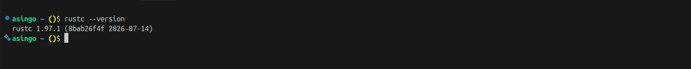

## Rust Installation

- We will download rust through *rustup*

### Installing rust on linux and or macos

``` bash
curl --proto '=https' --tlsv1.2 https://sh.rustup.rs -sSf | sh
```

### check whether rust is isntalled 

```bash
rustc --version
```
- sample output for running *rustc --version*



success!!!


- To update rust to newer versions we can then use
```bash
rustup update
```
- To then delete Rust we can use the following command
```bash 
rustup self uninstall
```


